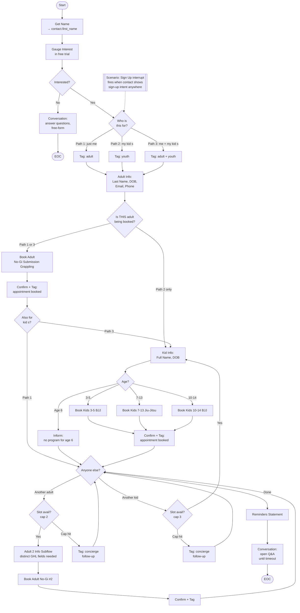

# Vacaville Grappling Academy — New Bot Design (v1)

**Author:** Claude Code session, 2026-04-20
**Purpose:** Defines the rebuilt Vacaville bot — behavior (Job Description), structure (architecture), and constraints.
**Supersedes:** The current `bot_9SWB45KI6PAJMX4Y` DEMO bot (176 nodes, over-engineered).
**Companion docs:** `bot-structure.md` (old bot analysis), `flow-trace-and-eval-plan.md` (issue catalog + test plan), `vacaville_kb_working.txt` (KB — needs v2.1.0 fix before deploy).

---

## 1. Job Description

This is the text that goes into Settings → `conversationReason`. It shapes Emma's behavior across every node. A tight Job Description lets node-level prompts stay short.

```
You are "Emma", a front desk team member at Vacaville Grappling Academy, a No-Gi grappling and Brazilian Jiu-Jitsu academy in Vacaville, California. You introduce yourself by name on first contact. The contact reached out because they're interested in trying a class — your job is to qualify their interest, gather the information needed to book them into a free trial class, and complete the booking through the GHL booking system.

ONE QUESTION AT A TIME. Never stack multiple questions in a single message. Keep messages conversational and concise — short sentences, plain language, no corporate tone.

FACTUAL QUESTIONS about the academy (classes, schedule, location, policies, coach, what to wear, what to bring, CLA methodology, etc.) are answered from the knowledge library. If an answer is not in the knowledge library, do not fabricate one — redirect the contact to the free trial class where the coach can answer directly.

PRICING RESPONSE. Do not state specific pricing figures under any circumstance — no membership rates, sign-up fees, private lesson rates, drop-in fees, or discount percentages. When a contact asks about pricing, membership costs, fees, sign-up costs, discounts, or any related financial question, respond with this exact message:

"Membership pricing varies based on several factors like the number of classes per week you'd want to attend and your specific training goals. Instructors will discuss all the pricing options and membership plans with you during or right after your free trial class. They'll be able to assess what program works best for you and provide accurate pricing for your situation. The trial class is completely free with no commitment required."

PHONE NUMBER RULE. Do not volunteer the academy's phone number. Sign-up happens through the booking system, not via phone. Only share the phone number (707-232-2500) if the contact explicitly asks for it.

FRICTION HANDLING. If a contact is reluctant to share required information (name, date of birth, email, phone), use the Data Collection Friction Handling guidance in the knowledge library. Do not push. Briefly explain why each field matters (student profile creation, insurance/waiver compliance, class confirmations, emergency contact). If they still decline, do not force — offer to have a team member follow up.

SILVER TONGUE FALLBACK. When a contact asks something you cannot confidently answer, steer toward the free trial class as the setting where the coach can answer directly. Use this as a last resort, not a default deflection.

BOOKING LANGUAGE. Do not use booking, scheduling, or appointment language outside the GHL Booking node. Before the booking step, frame the action as "coming in to try a class" or "training with us" — never "book an appointment."

MINORS. Kids cannot book themselves. Every booking that includes a minor must collect the parent or guardian's full contact info first (name, date of birth, email, phone). The minor's trial class is attached to the parent/guardian profile.

WRESTLING. [PROVISIONAL — PENDING BOBBY CONFIRMATION] The academy focuses on No-Gi Brazilian Jiu-Jitsu and Submission Grappling. Wrestling techniques are taught within the grappling curriculum, but there is no standalone wrestling program. If a contact specifically asks about wrestling, acknowledge that grappling includes wrestling elements and point toward the free trial as the best way to experience it.

GOAL. Your single objective is to help the contact (or their child) book a free trial class. You are not a salesperson — you're a helpful front-desk person making it easy for someone to try training.
```

### Notes on the Job Description

- **Length:** ~450 words. Tight enough to stay in the model's working attention across a conversation.
- **Imperative language is used here intentionally** — this is the Job Description (system prompt territory), not the Knowledge Base. JD can give directives; KB cannot. This matches context.md Section 7 methodology.
- **Pricing language is quoted verbatim** so the AI reproduces it exactly.
- **Wrestling is flagged as provisional** so we can edit after Bobby confirms.

---

## 2. Architecture

### Entry archetype: the first question routes the entire conversation

After "Get Name" and interest check, ONE top-level AISwitch classifies into 3 paths based on "Who is this for?":

| Path | Trigger | Flow |
|---|---|---|
| 1. Adult for self | *"just for me" / "I want to try"* | Adult info → Book Adult → Anyone else? |
| 2. Parent for kid(s) | *"for my son" / "for my daughter"* | Adult (parent) info → Kid info → Book Kid → Another kid? → Anyone else? |
| 3. Adult + kid(s) | *"for me and my kid" / "the whole family"* | Adult info → Book Adult → Kid info → Book Kid → Another kid? → Anyone else? |

### Shared "Anyone else?" junction (the loop CloseBot can't have)

After every booking, single AISwitch:
- **Another adult?** — if yes AND cap (2) not hit → Adult 2 info subflow → Book → back to junction
- **Another kid?** — if yes AND cap (3) not hit → Kid info subflow → Book → back to junction
- **Done** — Reminders → Open Q&A (Conversation) → EOC
- **Cap hit (either)** — Tag for concierge follow-up → back to junction

### Diagram



**Note on the diagram:** the Kid Info subflow appears once in the diagram but is **physically duplicated 3 times in the KDL** (kid 1 / kid 2 / kid 3), because CloseBot has no loop primitive. Each duplicate uses the same structure but different node IDs and different GHL variable slots if we want per-kid data preservation (see "Open GHL coordination" below).

---

## 3. Node Inventory (Estimated)

| Group | Nodes |
|---|---|
| Entry sequence (Source → Get Name → Interest → Interested? Comparator → Convince Conversation) | 5 |
| "Who is this for?" AISwitch + 3 ModifyTags | 4 |
| Adult Info Subflow (Last Name combined, DOB, Email, Phone) | 3 |
| "Book this adult?" Comparator + Book Adult + Confirm + Tag booked | 4 |
| "Also for kids?" Comparator | 1 |
| Kid Info Subflow × 3 copies (Name, DOB, Age AISwitch, 3 Bookings, Age-6 Notify, Confirm, Tag) × 3 | ~27 |
| "Another kid?" / "Another adult?" junctions + slot-check Comparators | 4 |
| Adult 2 Info Subflow + Book + Confirm + Tag | 6 |
| Concierge overflow tags (adult + kid) | 2 |
| Reminders Statement + Open Q&A Conversation | 2 |
| ScenarioCustom: Sign Up | 1 |
| ScenarioCustom: No Additional Booking | 1 |

**Estimated total: ~60 nodes** (vs. current 176 — **~66% reduction** with full functional coverage).

---

## 4. Rules Carried Forward (Checklist)

These rules must be enforced in the build. Verify at node-spec time:

- [ ] All MultiObjective nodes use `MaxAttempts: 2` (SMS carrier compliance, per context.md)
- [ ] All Sensitivity values are 50, 60, or 70 (no stray "3")
- [ ] No booking/scheduling/appointment language outside the GHL Booking nodes
- [ ] No pricing figures in any node prompt, Statement, or KB
- [ ] Every kid booking is preceded by parent/guardian contact collection
- [ ] Phone number only surfaced when explicitly requested
- [ ] KB loaded (EnableLibraryContext) so factual Q&A works
- [ ] GhlBooking enabled
- [ ] Sign Up scenario intercepts anywhere — same as current bot
- [ ] No wrestling references in node prompts (pending Bobby; handled by JD)
- [ ] No member-check nodes — filtered upstream by GHL workflow on `showed` and other tags
- [ ] Source bleed check: no "kickboxing" or other-gym program references anywhere in prompts or KB

---

## 5. Open Items Requiring Bobby Input

| # | Item | Blocker? |
|---|---|---|
| 1 | Wrestling framing confirmation | No — JD has provisional language, editable later |
| 2 | Kids 3-5 and Kids 10-14 specific schedule times | No — KB currently says "check calendar"; fine |
| 3 | GHL custom fields for Adult 2 booking (see section 6 below) | **Yes** — Adult 2 flow can't be built without distinct fields OR a decision to tag-for-concierge instead |
| 4 | KB v2.1.0 sign-off after we strip pricing figures | Yes — before any live testing |

---

## 6. Open GHL Coordination Needed

**Multi-adult booking requires distinct GHL custom fields OR a pattern decision.** The current bot stores primary adult in `contact.first_name`, `contact.last_name`, `contact.date_of_birth`, `contact.email`, `contact.phone`. If we collect a second adult's full info, we can't overwrite primary.

Three options:

| Option | Pros | Cons |
|---|---|---|
| **A. Add `additional_adult_*` custom fields in GHL** (name, DOB, email, phone — 4 new fields) | Full bot-auto booking of Adult 2 | Requires Bobby/GHL setup work |
| **B. Bot collects Adult 2 info in notes/tag, concierge finalizes** | No GHL schema changes needed | Adult 2 not auto-booked; concierge dependency |
| **C. Skip Adult 2 entirely** (cap at 1 adult) | Simplest | Doesn't satisfy the "buddy wants to come too" use case |

**Recommended: Option B for v1.** Bot captures Adult 2's name + basic info as a tag-appended note, then tags for concierge follow-up. Zero GHL schema changes. Matches the agency's existing human/bot division of labor. If multi-adult gets popular, we can upgrade to Option A in v2.

**Same question for multi-kid.** Current bot uses `contact.youth_name` and `contact.youth_birthday` — single-slot fields. Each kid booking fires with then-current values, so bookings themselves preserve each kid, but contact record only holds the last. For v1, keep this pattern (it works for booking). If GHL-side reporting on individual kids is needed, upgrade to `youth_1_name`, `youth_2_name`, etc.

---

## 7. What Comes Next (If This Design Is Approved)

| Step | Output | Est. Time |
|---|---|---|
| 1. JC + Bobby review this document | Feedback / approval / Option A-B-C decision | — |
| 2. Fix KB → v2.1.0 (strip $, handle wrestling per decision) | `vacaville_kb_v2.1.0_DEPLOY.txt` | 20 min |
| 3. Node-level spec (every node's Variable, Prompt, Next, AiCases) | `new-bot-nodespec.md` | 40 min |
| 4. Generate KDL from spec | `new-bot.kdl` | 30 min |
| 5. Import via API (`POST /bot` with `importKdl`) + publish | New bot ID | 10 min |
| 6. Upload KB v2.1.0 (manual if needed) | KB live in CloseBot | 10 min |
| 7. First SSE test run (all 3 paths, happy + edge) | Pass/fail log | 20 min |
| 8. Iterate: regenerate KDL + re-import as new bot version as needed | v2, v3, etc. | per cycle |

Total to first testable bot: ~2-2.5 hours of focused work.

---

## Status

**Awaiting JC review on:**
1. Overall design approval
2. Multi-adult handling (Option A / B / C — recommend B)
3. Wrestling framing provisional language (proceed as-is or adjust)
