# Vacaville v3.1 — Flow Chart

```mermaid
flowchart TD
    START([New Lead Message]) --> SRC[n01 Source]

    %% ── Scenarios (always-listening) ──
    SRC -.->|Priority 80| NS01[ns01 Who Is This?]
    SRC -.->|Priority 75| NS03[ns03 Mil/LE/FR]
    SRC -.->|Priority 70| NS04[ns04 Drop-In]
    SRC -.->|Priority 50| N90[n90 Signup Interrupt]
    SRC -.->|Priority 50| N91[n91 No Additional Booking]

    NS01 --> ND01[nd01 Re-intro Statement\nYou signed up via social media ad...]
    ND01 --> N06

    NS03 --> ND03T[nd03 Tag: needs-handoff-discount]
    ND03T --> ND03M[nd03 Statement: Thank you for service\nTeam will reach out]
    ND03M --> ND03S([nd03 Stop Responding])

    NS04 --> ND04T[nd04 Tag: concierge - drop-in]
    ND04T --> ND04M[nd04 Statement: Team will reach out\nwith drop-in details]
    ND04M --> ND04S([nd04 Stop Responding])

    N90 --> N06
    N91 --> N79

    %% ── Main Flow ──
    SRC --> N02[n02 Get First Name\nSkipIfNotBlank]
    N02 --> N06[n06 Who Is This For?\nadult / kids / both]
    N06 --> N07{n07 Route by Enrollee}

    N07 -->|adult only| N08[n08 Tag: adult]
    N07 -->|kids only| N09[n09 Tag: youth]
    N07 -->|both| N10[n10 Tag: adult + youth]

    N08 & N09 & N10 --> N11[n11 Adult Last Name]
    N11 --> N12[n12 Adult DOB]
    N12 --> N13[n13 Adult Email]
    N13 --> N14[n14 Adult Phone]
    N14 --> N15{n15 Book This Adult?}

    N15 -->|YES| N16[n16 Booking: Adult No-Gi\nAsk preference → tool finds real slot]
    N15 -->|NO| N20

    N16 --> N17[n17 Statement: Confirm Adult Booking\ndate, time, gear reminder]
    N17 --> N18[n18 Tag: appointment booked]
    N18 --> N19{n19 Also Booking Kids?}

    N19 -->|YES| N20[n20 Kid 1: Name + DOB]
    N19 -->|NO| N40

    %% ── Kid 1 ──
    N20 --> N21{n21 Kid 1 Age Route}
    N21 -->|3-5| N22[n22 Booking: Kids 3-5 BJJ]
    N21 -->|6-13| N23[n23 Booking: Kids 7-13 Jiu-Jitsu]
    N21 -->|10-14| N24[n24 Booking: Kids 10-14 BJJ]
    N22 & N23 & N24 --> N26[n26 Statement: Confirm Kid 1]
    N26 --> N27[n27 Tag: appointment booked]
    N27 --> N40

    %% ── Anyone Else 1 ──
    N40{n40 Anyone Else?} -->|another kid| N41[n41 Kid 2: Name + DOB]
    N40 -->|another adult| N70[n70 Additional Adult Name]
    N40 -->|done| N79

    %% ── Kid 2 ──
    N41 --> N42{n42 Kid 2 Age Route}
    N42 -->|3-5| N43[n43 Booking: Kids 3-5]
    N42 -->|6-13| N44[n44 Booking: Kids 7-13]
    N42 -->|10-14| N45[n45 Booking: Kids 10-14]
    N43 & N44 & N45 --> N47[n47 Confirm Kid 2]
    N47 --> N48[n48 Tag: appointment booked]
    N48 --> N50

    %% ── Anyone Else 2 ──
    N50{n50 Anyone Else?} -->|another kid| N51[n51 Kid 3: Name + DOB]
    N50 -->|another adult| N70
    N50 -->|done| N79

    %% ── Kid 3 ──
    N51 --> N52{n52 Kid 3 Age Route}
    N52 -->|3-5| N53[n53 Booking: Kids 3-5]
    N52 -->|6-13| N54[n54 Booking: Kids 7-13]
    N52 -->|10-14| N55[n55 Booking: Kids 10-14]
    N53 & N54 & N55 --> N57[n57 Confirm Kid 3]
    N57 --> N58[n58 Tag: appointment booked]
    N58 --> N60

    %% ── Anyone Else 3 ──
    N60{n60 Anyone Else? kid cap} -->|another adult| N70
    N60 -->|more kids overflow| N61[n61 Tag: concierge - additional kids]
    N60 -->|done| N79

    N70[n70 Capture Additional Adult Name] --> N71[n71 Tag: concierge - additional adult]
    N71 --> N79

    N61 --> N79

    %% ── Wrap Up ──
    N79[n79 SetField: write youth names\ncomma-pack kid1+kid2+kid3 → contact.youth_name]
    N79 --> N80[n80 Statement: Reminders\ngear, water, arrive early]
    N80 --> N81[n81 Conversation: Open Q&A\nanswer remaining questions from KB]
    N81 --> EOC([End of Conversation])

    %% ── Styling ──
    classDef scenario fill:#7B3FBE,color:#fff,stroke:#5a2d8e
    classDef booking fill:#1a6b3c,color:#fff,stroke:#0f4526
    classDef tag fill:#2b5797,color:#fff,stroke:#1a3a6b
    classDef stop fill:#8B0000,color:#fff,stroke:#600000
    classDef statement fill:#3d6b8e,color:#fff,stroke:#2a4f6b

    class NS01,NS03,NS04,N90,N91 scenario
    class N16,N22,N23,N24,N43,N44,N45,N53,N54,N55 booking
    class N08,N09,N10,N18,N27,N48,N58,N61,N71 tag
    class ND03S,ND04S stop
    class N17,N26,N47,N57,ND01,ND03M,ND04M statement
```

**Legend:**
- 🟣 Purple = Scenario (always-listening, fires from anywhere)
- 🟢 Green = Booking node (calls GHL calendar tool)
- 🔵 Blue = Tag / ModifyTags
- 🔴 Red = Stop Responding
- 🟦 Statement = AI-generated confirmation message

**Node count:** 66 nodes total (46 main flow + 5 scenarios + 15 scenario destination nodes)  
**Bot ID:** `bot_WWN34OSTR0CYZHKZ` (v3.1)  
**Source:** `src_GDKORXSW4Q8RQUQ8` (Vacaville Grappling Academy)
